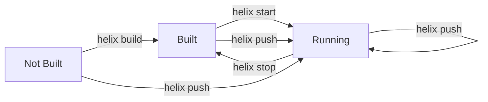

Helix provides commands for managing the lifecycle of your instances, including starting, stopping, restarting, and checking status.

## helix start

Start an instance that has been built but is not currently running.

### Usage

```bash
helix start [INSTANCE]
```

<ParamField path="INSTANCE" type="string">
  Instance name to start. If not provided, you'll be prompted to select from available instances.
</ParamField>

### Local Instances

Start a local Docker container:

```bash
helix start dev
```

**Output:**
```
✓ Starting dev
  ✓ Starting container

Local URL:    http://localhost:6969
Container:    helix_myproject_dev
Data volume:  /home/user/.helix/dev/volumes/data
```

<Note>
The instance must be built first with `helix build` or `helix push`. If not built, you'll see:

```
✗ Starting dev

Error: instance 'dev' has not been built yet

Hint: run 'helix build dev' first to build the instance
```
</Note>

### Cloud Instances

Start a cloud instance (Fly.io example):

```bash
helix start prod-fly
```

**Output:**
```
✓ Starting prod-fly
  ✓ Starting cloud instance (cluster: cluster_abc123)
```

### Interactive Selection

```bash
helix start
```

**Prompt:**
```
◆  Select an instance:
│  ● dev (Local)
│  ○ staging (Helix Cloud)
│  ○ production (Helix Cloud)
```

---

## helix stop

Stop a running instance without removing data or the image.

### Usage

```bash
helix stop [INSTANCE]
```

<ParamField path="INSTANCE" type="string">
  Instance name to stop. If not provided, you'll be prompted to select from available instances.
</ParamField>

### Local Instances

Stop a local Docker container:

```bash
helix stop dev
```

**Output:**
```
✓ Stopping dev
  ✓ Stopping container
```

The container is stopped but:
- Data persists in the volume
- Docker image remains cached
- Can be restarted with `helix start dev`

### Cloud Instances

Stop a cloud instance (Fly.io example):

```bash
helix stop prod-fly
```

**Output:**
```
✓ Stopping prod-fly
  ✓ Stopping cloud instance
```

---

## helix restart

Restart an instance (stops then starts). This is useful for applying configuration changes without rebuilding.

### Usage

```bash
helix restart [INSTANCE]
```

<ParamField path="INSTANCE" type="string">
  Instance name to restart. If not provided, you'll be prompted to select from available instances.
</ParamField>

### Local Instances

Restart a local instance:

```bash
helix restart dev
```

**Output:**
```
✓ Restarting dev
  ✓ Restarting container
```

This:
1. Stops the running container
2. Starts it again with the same configuration
3. Preserves all data in the volume

<Note>
`helix restart` does NOT rebuild the image. To rebuild and restart, use:
```bash
helix push dev
```
</Note>

### Cloud Instances

Restart a cloud instance:

```bash
helix restart staging
```

**Output:**
```
✓ Restarting staging
  ✓ Restarting cloud instance
```

---

## helix status

Show the status of all configured instances.

### Usage

```bash
helix status
```

No arguments needed - shows all instances.

### Output

```
Helix Project Status

Project:  my-project
Root:     /home/user/projects/my-project

Configured Instances:
  dev (Local)              port 6969
  staging (Helix Cloud)    cluster cluster_abc123
  production (Helix Cloud) cluster cluster_xyz789
  prod-ecr (AWS ECR)       repository my-helix-repo in us-east-1

Running Containers:
  [UP]   dev              Up 2 hours (0.0.0.0:6969->6969/tcp)
  [DOWN] test             Exited (0) 5 minutes ago
```

### Status Indicators

- **[UP]** - Container is running
- **[DOWN]** - Container is stopped

### Container Information

For each running container, you'll see:
- Instance name
- Status (how long it's been running)
- Port mappings

### Non-Project Directory

If you run `helix status` outside a Helix project:

```
Error: Not in a Helix project directory. Run 'helix init' to create one.
```

---

## Common Workflows

### Development Cycle

```bash
# Start your dev instance
helix start dev

# Make changes to queries
vim db/queries.hx

# Rebuild and restart
helix push dev

# View logs
helix logs dev

# Stop when done
helix stop dev
```

### Multiple Instances

```bash
# Start local dev
helix start dev

# Start local test instance
helix start test

# Check what's running
helix status

# Stop all
helix stop dev
helix stop test
```

### Troubleshooting

```bash
# Check status
helix status

# Restart if stuck
helix restart dev

# View logs
helix logs dev

# Stop and rebuild
helix stop dev
helix build dev
helix start dev
```

## Docker Commands

Under the hood, Helix uses Docker. You can also use Docker commands directly:

```bash
# View all Helix containers
docker ps -a | grep helix

# View logs
docker logs helix-myproject-dev

# Execute commands in container
docker exec -it helix-myproject-dev sh

# View resource usage
docker stats helix-myproject-dev
```

## Port Conflicts

If you see a port conflict:

```
Error: Port 6969 is already in use
```

**Solutions:**

1. Stop the conflicting instance:
   ```bash
   helix stop dev
   ```

2. Change the port in `helix.toml`:
   ```toml
   [local.dev]
   port = 6970
   ```

3. Find what's using the port:
   ```bash
   # Linux/macOS
   lsof -i :6969
   
   # Windows
   netstat -ano | findstr :6969
   ```

## Error Handling

### Instance Not Built

```
Error: instance 'dev' has not been built yet

Hint: run 'helix build dev' first to build the instance
```

**Solution:** Build before starting:
```bash
helix build dev
helix start dev
```

Or use `helix push dev` which builds and starts in one command.

### Docker Not Running

```
Error: Docker is not running or not accessible

Hint: Start Docker Desktop or the Docker daemon
```

**Solution:** Start Docker:
- **macOS/Windows:** Open Docker Desktop
- **Linux:** `sudo systemctl start docker`

### Permission Denied

```
Error: Permission denied while connecting to Docker daemon
```

**Solution:** Add your user to the docker group:
```bash
sudo usermod -aG docker $USER
# Log out and back in for changes to take effect
```

## Instance Lifecycle



## Data Persistence

Instance data persists across restarts:

- **Local instances:** Data stored in `.helix/<instance>/volumes/data`
- **Cloud instances:** Data managed by cloud provider

### Backup Local Data

```bash
# Create backup
helix backup dev --output ./backups/

# Data is in tarball
ls backups/
# backup-2024-01-15-143022/
```

### Delete Instance Data

```bash
# Delete instance completely (including data)
helix delete dev

# Prune unused resources
helix prune
```

## Next Steps

- **View logs:** [helix logs](/cli/instances#logs)
- **Cloud operations:** [helix auth, sync](/cli/cloud)
- **Backup data:** `helix backup dev`